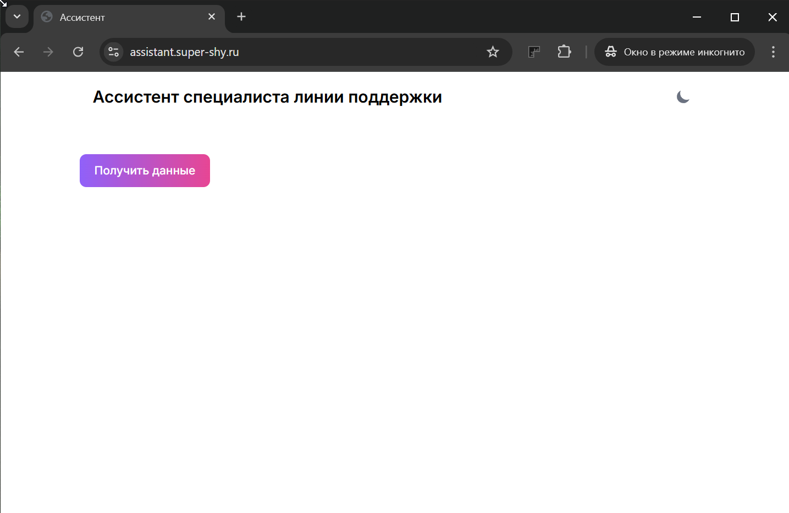
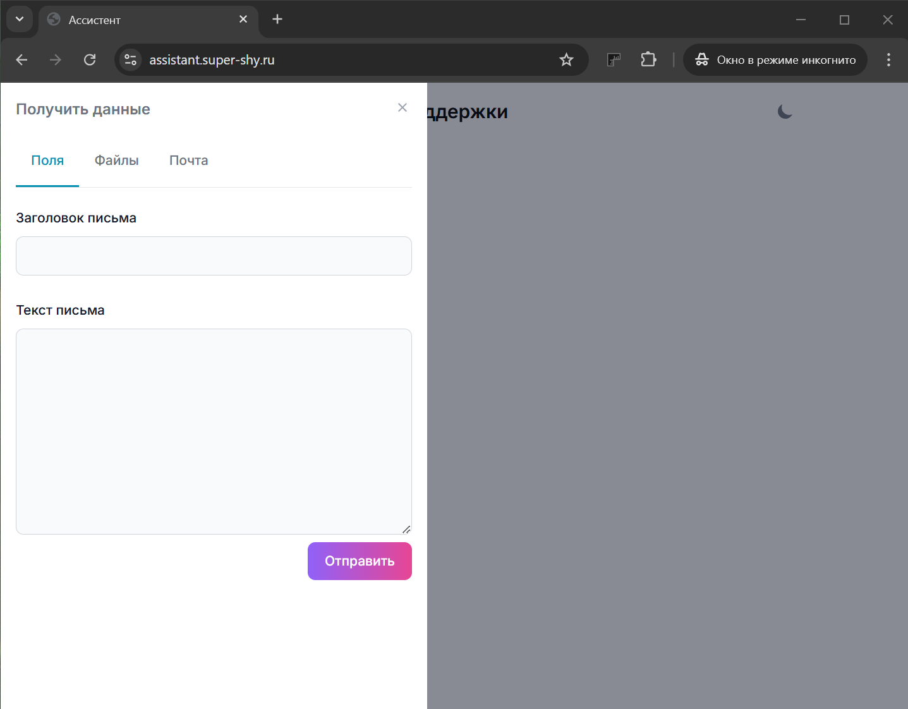
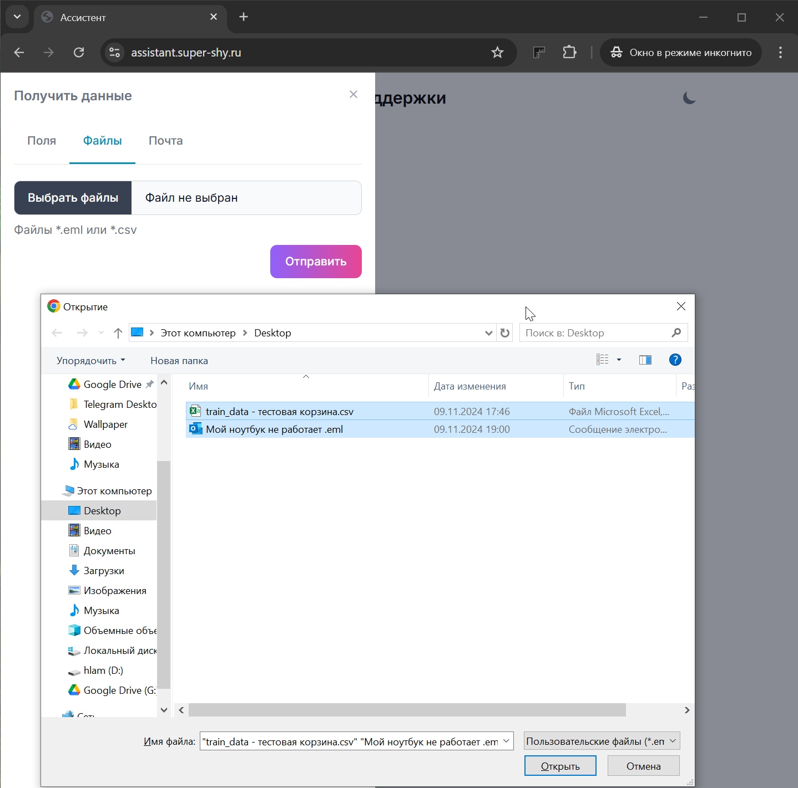
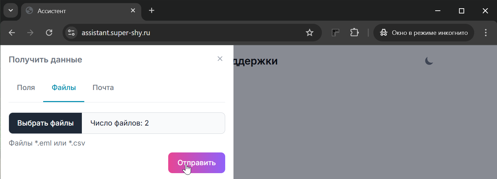
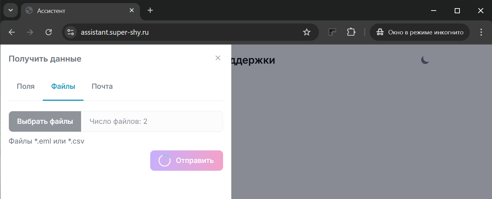
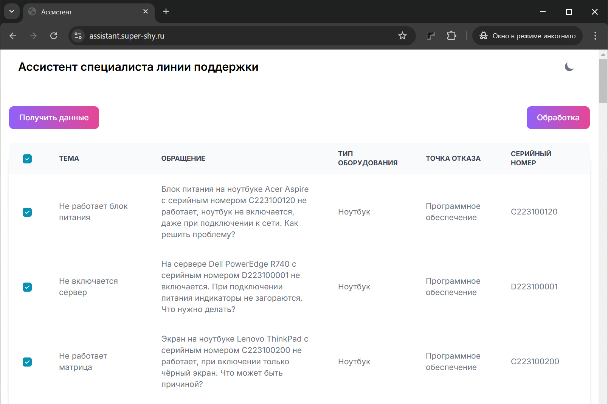
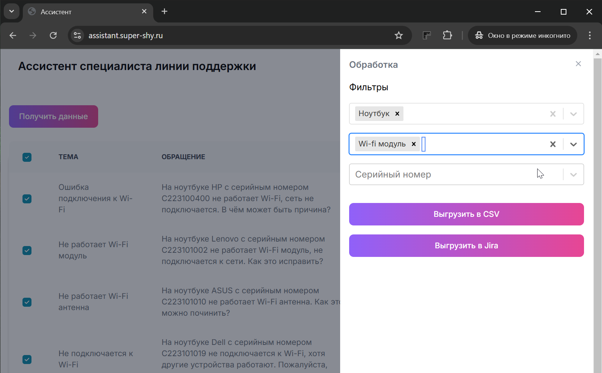

# Приложение для помощи сотруднику первой линии поддержки

## Требования

Для работы приложения необходима NodeJS не ниже 18 версии и docker

## Установка и запуск

Приложение работает в связке с Ollama.
Для её установки и запуска в докере необходимо выполнить следующую инструкцию

```
docker run -d --gpus=all -v ollama:/root/.ollama -p 11434:11434 --name ollama ollama/ollama
```

Также необходимо загрузить модель qwen. Для этого необходимо перейти в терминал докер контейнера и выполнить

```
ollama run qwen2.5
```

Следующим шагом необходимо перейти в папку с исходным кодом приложения и установить зависимости, выполнив

```
npm i
```

После установки зависимостей необходимо в этой же папке создать файл .env со следующим содержимым

```
OOLAMA_URL="http://localhost:11434"
```

Теперь можно приступить к билду. Для этого применяется команда

```
npm run build
```

Для запуска необходимо выполнить

```
npm start
```

В случае успешного старта приложение доступно по адресу http://localhost:3000

## Как пользоваться приложением

Подразумевается, что приложение является промежуточным звеном между почтой, в которую падают заявки от клиентов, и таск трекером. Его задачей является автоматизированное заполнение необходимых полей в заявках таск трекера.

На главной странице есть кнопка "Получить данные", нажатие по которой открывает боковую панель с возможными вариантами загрузки данных из почты





Существует возможно загрузки данных вручную через поля, а так же из файлов csv и eml

Для загрузки данных из файлов необходимо перейти на вкладку "Файлы" и кликнуть по полю "Выбрать файлы". Откроется окно выбора файлов. Можно выбирать сразу несколько файлов разных форматов.



После подтверждения выбора необходимо нажать кнопку "Отправить", чтобы получить заполненные нейросетью данные.



Начнётся обработка текстов писем



После окончания обработки на странице приложения появится таблица с полями. Если какое-то поле не удалось запомнить, то оно будет заполнено ключевым словом УТОЧНИТЬ.



Также справа появится кнопка "Обработка", нажатие на которую приведёт к открытие панели фильтров и выгрузки данных.



После фильтрации результирующую таблицу можно выгрузить в csv формате, либо в JSON для последующей загрузки в таск трекер. Приложение можно доработать, чтобы выгрузка осуществлялась напрямую в таск трекер.

## API

Для обработки текстов писем реализованы методы api, к которым можно обращаться напрямую, минуя веб приложение. Они доступны по адресам '/api/message' для обработки текста в формате JSON. В теле POST запроса ожидается объект вида

```
{
  subject: string;
  text: string;
}
```

Для обработки файлов используется метод `/api/binaryMessages` ожидается массив объектов типа `File`.

Результатом работы методов являются объекты вида

```
{
  subject: string;
  text: string;
  problem: string;
  device: string;
  sn: string;
}
```
